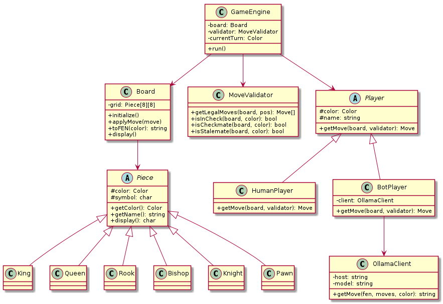
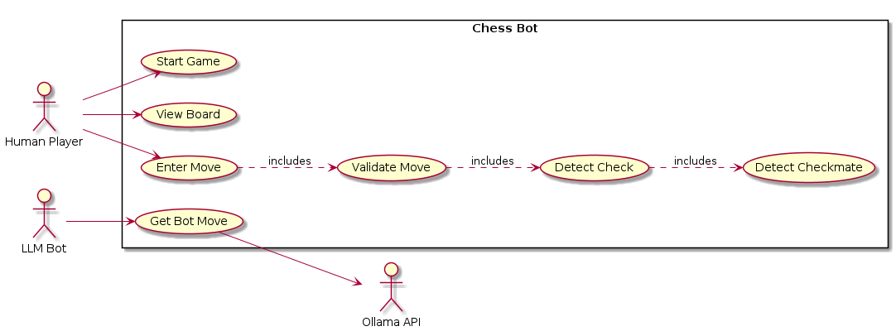
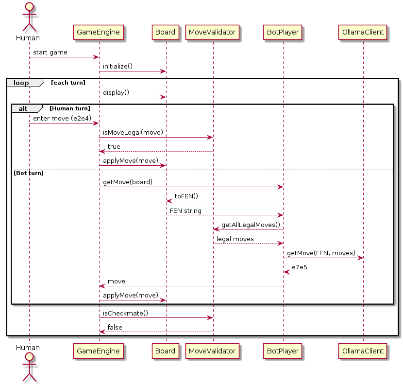

# ♟️ Chess Bot

Play chess against a locally running LLM via [Ollama](https://ollama.com). Chess engine built from scratch in C++.

---

## Demo

```
    a  b  c  d  e  f  g  h
  +------------------------+
8 |  r  n  b  q  k  b  n  r | 8
7 |  p  p  p  p  p  p  p  p | 7
6 |  .  .  .  .  .  .  .  . | 6
5 |  .  .  .  .  .  .  .  . | 5
4 |  .  .  .  .  P  .  .  . | 4
3 |  .  .  .  .  .  .  .  . | 3
2 |  P  P  P  P  .  P  P  P | 2
1 |  R  N  B  Q  K  B  N  R | 1
  +------------------------+
    a  b  c  d  e  f  g  h

  Move 1 — Black's turn
  [Bot thinking...]
  → Bot played: e7e5
```

---

## UML Diagrams

### Class Diagram


### Use Case Diagram


### Sequence Diagram


---

## Setup

### 1. Install Ollama & pull a model
```bash
curl -fsSL https://ollama.com/install.sh | sh
ollama pull llama3.2:1b
```

### 2. Install dependencies

| OS | Command |
|---|---|
| Arch | `sudo pacman -S cmake curl` |
| Ubuntu | `sudo apt install cmake libcurl4-openssl-dev` |
| Mac | `brew install cmake curl` |
| Windows | `vcpkg install curl` |

### 3. Build & Run
```bash
mkdir build && cd build
cmake ..
make

# start ollama first
ollama serve

# then run
./main

# use a different model
./main qwen2.5:1b
```

---

## How to Play

- You are **White**, the bot is **Black**
- Enter moves as `e2e4` (from → to)
- Type `quit` to exit

---

## Project Structure

```
chess-bot/
├── Piece.h / .cpp         # Abstract Piece + 6 subclasses
├── Board.h / .cpp         # Board state, display, FEN
├── MoveValidator.h / .cpp # Legal moves, check, checkmate
├── Player.h / .cpp        # Abstract Player + HumanPlayer
├── BotPlayer.h / .cpp     # LLM bot player
├── OllamaClient.h / .cpp  # HTTP client for Ollama API
├── GameEngine.h / .cpp    # Game loop, turn management
├── main.cpp               # Entry point
├── CMakeLists.txt
└── diagrams/              # UML diagrams
```

---

## Known Limitations

- No castling or en passant
- Pawn always promotes to Queen
- Bot strength depends on the model used — larger models play better

---

## License

MIT